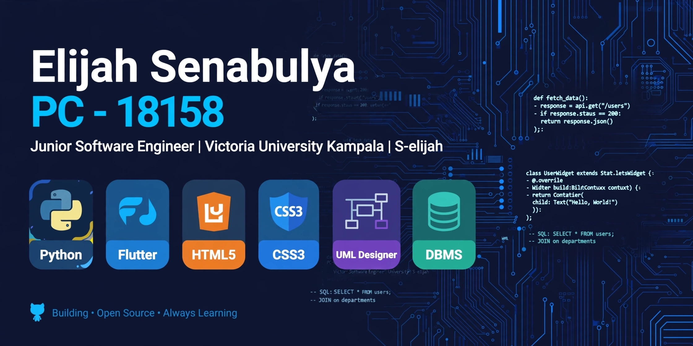

# I'm Elijah Senabulya 
**Junior Software Engineer | Victoria University Kampala (Y2) | PC - 18158**

> Building mobile & web systems with Python, Flutter, HTML/CSS, UML & DBMS

### 🛠 Tech Stack

###  Connect
- X: @KSenabulyaE
- Portfolio: [https://elijah-senabulya-portfolio.vercel.app]
- LinkedIn: [https://www.linkedin.com/in/elijah-senabulya-72ba35324]
- PLU: PC - 18158
- [LinkedIn Newsletter: Legal Tech Uganda](https://www.linkedin.com/build-relation/newsletter-follow?entityUrn=7414961441046413312)
- TikTok:[@elijah.legaltech](https://www.tiktok.com/@elijah.legaltech) 30s Legal Tech Explained

### Business Tech Content

I build websites, POS systems, Tracking systems and applications

*"Building the case for trusted legal and business technology."*

